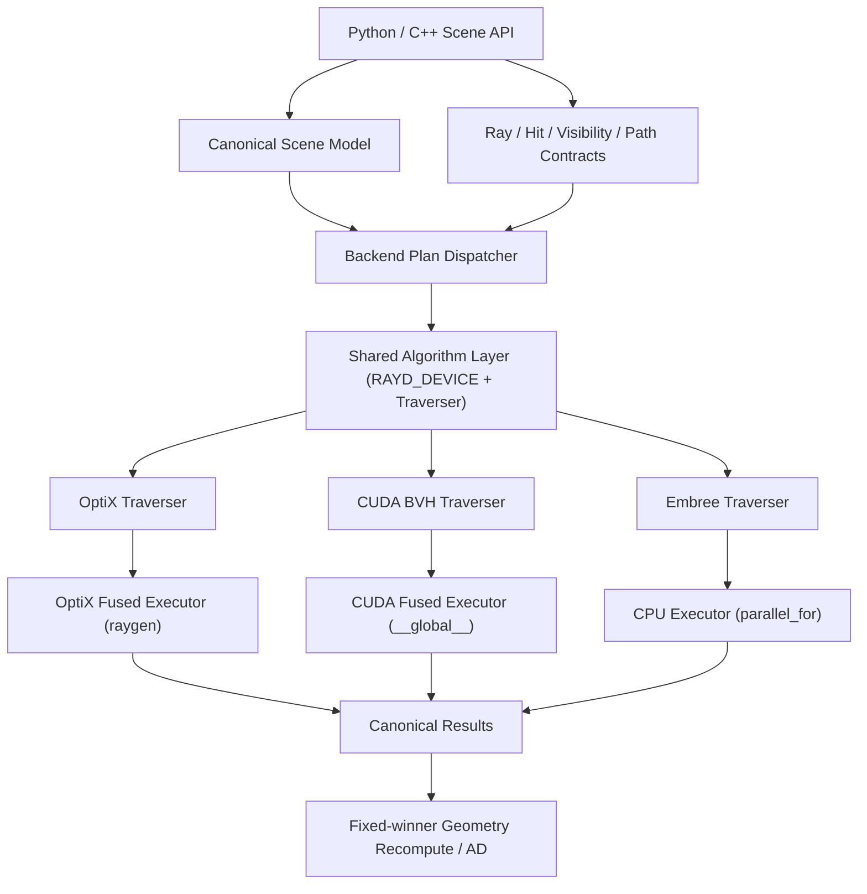

# RayD 多光线追踪后端架构方案

> 本文档合并了原架构草案与一次针对 Jetson Orin 移植的代码核查 + 设计审计。
> 标注约定：**[已核查]** 表示有 `file:line` 证据；**[推断]** 表示架构判断，尚无实测；**[待实测]** 表示必须在目标硬件上验证后才能定论。

## 1. 背景与目标

RayD 当前的三角形光线追踪、可见性查询以及大部分 multipath 原生路径都建立在 NVIDIA OptiX 之上。本方案将具体光线追踪实现从几何、自动微分和 multipath 公共语义中抽离，形成三个正式后端：

1. **OptiX backend**：保留现有高性能路径，作为支持 OptiX 的 NVIDIA GPU 默认实现；
2. **Pure CUDA backend**：使用软件 BVH 构建与遍历，面向没有 OptiX 驱动的 CUDA 设备（Jetson Orin 是首要目标）；
3. **Embree CPU backend**：使用 Intel Embree 完成 CPU 三角形加速结构与光线查询。

公共 Python/C++ API 应尽量保持兼容。不同后端共享相同的输入、输出、ID 空间、数值策略和 fixed-winner AD 语义，但不强迫采用相同的底层执行模型。

RayD 仍然只负责可微几何、边查询与 multipath primitives，不扩展为包含 BSDF、Emitter、Integrator、Scene Loader 或 Material-Light-Integrator 框架的完整渲染器。

### 1.1 直接动因：Jetson Orin

- **硬件有 RT Core。** Orin 的 GA10B 是 Ampere 架构，官方数据手册明确每个 TPC 含一个 RT Core，用于加速 BVH 遍历与求交。AGX Orin / Orin NX / Orin Nano 全系具备。
- **但 OptiX 在 Jetson 上不可用，且官方明确不支持。** NVIDIA 版主 kayccc（2026-03，Sionna-RT on Orin Nano 用例）："Optix is not supported on Jetson platform. We will evaluate this for future release."。2022 年关于「如何访问 Orin 的 RT Core」的提问，官方回答是用 Vulkan，并称 OptiX 支持 "not planned"。根因是工程性的：JetPack 出于体积考虑不打包 OptiX 驱动侧组件，L4T 驱动中没有 `libnvoptix.so`。
- **RT Core 密度本就偏低。** Orin 是每 TPC（= 2 SM）一个 RT Core，AGX Orin 16 个 SM 约合 8 个 RT Core；桌面 Ampere/Ada/Blackwell 是每 SM 一个（RTX 5080 有 84 个）。即 Orin 的 RT Core 密度只有桌面的一半，绝对吞吐很低。**[推断]** 这压缩了软件遍历相对硬件遍历的劣势，但真实差距**[待实测]**。
- **同类项目的前例。** Sionna-RT 能在 Jetson 上运行，但只能跑 LLVM/CPU 变体，因为其 CUDA 变体经 Mitsuba → Dr.Jit → OptiX。RayD 是同构的东西，会撞同一堵墙。

### 1.2 为什么不选 Vulkan RT

访问 Orin RT Core 的唯一官方途径是 Vulkan ray tracing（`VK_KHR_ray_query` / `VK_KHR_acceleration_structure`）。本方案**明确不采用**，理由按重要性排序：

1. **与 Dr.Jit 的 AD 断链。** RayD 的全部价值在于可微 ray geometry。Vulkan RT 意味着几何数据活在 Vulkan buffer 中，需 CUDA-Vulkan external memory + semaphore interop，且真正的 IP（UTD 衍射、EPC、reflection geometry，全在 closest-hit 逻辑里）须以 GLSL/SPIR-V 重写并脱离 AD 图。多 bounce trace 会退化为「每 bounce 一次 Vulkan↔CUDA 往返 + 信号量同步」，现有单 kernel 跑完整条 trace 的优势全部丢失。
2. **驱动路径未经验证。** 有报告称 Orin + JetPack 6.0 上 `vulkaninfo` 报告支持 `VK_KHR_ray_query`，但 `vkCreateDevice` 请求该扩展时返回 `ERROR_INITIALIZATION_FAILED`。未找到后续 JetPack 修复的确认。**[待实测]** 这等于把移植押在一个我们不控制的驱动缺陷上——与依赖 OptiX 是同一类错误。
3. **加速结构是驱动私有黑盒。** 现有 `nearest_edge` 需要「选出 winning edge 后重新 gather AD 几何并重算精确值」，这种对 AS 的白盒控制在 Vulkan 中无法实现。

**结论：Pure CUDA 软件 BVH 是 Orin 的主路径。** 代价是放弃 RT Core 硬件加速；收益是保留 AD、保留白盒控制、消除不可控依赖，并顺带获得唯一的软件退路（见 §2.3）。若未来 NVIDIA 在 JetPack 中提供 `libnvoptix.so`，OptiX 后端可直接复用，无需重做架构。

## 2. 现状核查

### 2.1 已有资产

- `shared/contracts/operations.json` 已定义跨 Dr.Jit/Torch 的操作、结果与 AD 契约；
- **[已核查]** `backends/drjit/src/edge/scene_edge.cpp`（2271 行，**grep 验证零 OptiX 引用**）+ `src/edge/edge_bvh.cu`（905）+ `shared/src/edge/bvh_build.cu`（617）/ `bvh_query.cu`（511）/ `edge_distance.cu`（156）构成约 4400 行**已可用、可微、支持 refit 的纯 CUDA GPU BVH**。这是整个移植最强的资产：它已经证明了 non-OptiX 模式在 RayD 中可行。
- **[已核查]** 该后端**运行时可选**：`Scene(edge_bvh_backend=...)`，枚举 `DrJit`/`Optix`(默认)/`OptixDrJit` 定义在 `backends/drjit/include/rayd/scene/scene.h:45-50`，解析在 `src/scene/scene.cpp:66-82`，Python 入口 `src/rayd.cpp:1760` → `rd.Scene(edge_bvh_backend="drjit")`。是构造参数，**不是环境变量**。
- **[已核查]** `shared/include/rayd/shared/math/vec3.h:5-9` 已是 host/device 双兼容：`__CUDACC__` 下为 `__host__ __device__ __forceinline__`，否则为普通 `inline`，且只依赖 `<cmath>`。**中立向量类型今天就能在 CPU 上编译**，宏模式已经存在——这是算法层去 CUDA 化的现成起点（见 §6）。
- **[已核查]** Dr.Jit 后端**不需要 OptiX SDK**：`backends/drjit/include/rayd/optix.h` 手写声明 host API；PTX 已签入仓库（`.target sm_70`），仅在 `RAYD_REGENERATE_*_PTX`（默认 `OFF`，`CMakeLists.txt:14-21`）时才需要 SDK 重新生成。§14 中「CUDA-only build 不需要 OptiX SDK」这条硬性要求，**对 drjit 后端已经成立**。
- `Scene::intersect()` 已采用 detached broad phase 加 AD geometry re-gather/recompute 的 fixed-winner 设计；scene-global primitive、mesh-local primitive 和 edge ID 已有明确映射。

### 2.2 OptiX 耦合的真实形状：结构上深，语义上浅

**[已核查]** 103 个源文件引用 OptiX，但真正的耦合集中在约 4 个 host 文件加一个 pipeline builder：

| 文件 | 行数 | 角色 |
| --- | ---: | --- |
| `backends/drjit/src/scene/scene_optix.cpp` | 1064 | GAS/IAS `optixAccelBuild`(:387,:469,:577)、`jit_optix_ray_trace`(:845,:942,:1025) |
| `backends/drjit/src/multipath/pipelines.cpp` | 571 | 通用 pipeline/SBT builder，`optixLaunch`(:324) |
| `backends/drjit/src/edge/scene_edge_optix.cpp` | 869 | custom-AABB edge GAS + `optixLaunch`(:133) |
| `backends/drjit/src/optix.cpp` | 314 | 驱动加载、函数表查找、SBT record |
| `backends/drjit/src/scene/scene_multipath.cpp` | 7566 | multipath dispatch（仓库最大文件） |

**关键发现：`shared/**` 中每一处 `optixTrace` 用的都是内建三角形几何 + `OPTIX_RAY_FLAG_DISABLE_ANYHIT` + 标准 closest-hit/occlusion 语义**（`reflection_trace_device.cuh:98-114`、`reflection_epc_device.cuh:148-164,218-234`、`segment_visibility_device.cuh:129-134`）。

因此一个 `trace_closest(o,d,tmin,tmax) -> (t, prim, inst, bary)` 原语加一个 occlusion 变体，即可覆盖几乎全部 multipath 工作量。**只有 `edge_optix.cu` 需要 custom AABB 求交**（3 个 `__intersection__` program）——而那部分已有纯 CUDA 实现。

`.cu` 文件是薄壳：`reflection_trace.cu` 仅 26 行，全部逻辑在 `shared/include/rayd/shared/optix/*_device.cuh`。收口点 `trace_handle()`（`reflection_trace_device.cuh:88`）是唯一直接调 `optixTrace` 的地方。

**已经 OptiX-free、可原样移植**：`reflection_epc_field.cu`(358)、`diffraction_accumulation_ad.cu`(2119)、`reflection_dedup.cu`(393)、`shared/src/multipath/reflection_dedup.cu`(176)、`shared/src/scene/packing.cu`(106)、全部 `shared/src/edge/*.cu`。

### 2.3 阻塞项（按严重度排序）

1. **[已核查] Jetson 无 `libnvoptix.so.1`。** 加载器目标见 `optix.cpp:143`（Linux）/ `:66`（Windows `nvoptix.dll`）；`.github/workflows/pypi.yml:97` 的 `auditwheel --exclude libnvoptix.so.1` 佐证其从不打包。版本钉在 `optix.h:3-4`：`RAYD_OPTIX_TARGET_VERSION 80100`（OptiX 8.1.0）、`RAYD_OPTIX_TARGET_ABI 93`，ABI 在 `optix.cpp:191-197` 与驱动实测比对。**不可回避，必须有替代 traversal 层。**
2. **[已核查] `Scene::build()` 无条件构建 OptiX GAS。** `src/scene/scene.cpp:722-730` 调用 `optix_scene_->build(mesh_descs)`，位置在 edge-backend 分支（:734+）**之前**。**后果：即便 `edge_bvh_backend="drjit"` 提供了完全无 OptiX 的 `nearest_edge`，也无法经由 `Scene` 抵达——`build()` 先就失败。** 这是「在 Orin 上零代码验证已有 CUDA BVH」不成立的原因，必须先解耦。
3. **[已核查] 发布 wheel 在 Orin 上无法加载。** gencode 列表为 `70,75,80,86,89,90,100,101,120`，**缺 87**，且唯一 PTX fallback 是 `compute_120`（`pypi.yml:22-23,85-86`，由 `backends/drjit/scripts/verify_cuda_binary_arches.py:11-12` 强制）。PTX 只能向前 JIT，`compute_120` **无法降级到 sm_87**。叠加 `CIBW_BUILD: cp3XX-manylinux_x86_64`(:67,140) 与 CUDA 源钉在 `repos/rhel8/x86_64`(:73-74)，Orin 必须源码构建。
4. **[已核查] `drjit==1.3.1` 无 aarch64 wheel**（精确钉死于 `backends/drjit/pyproject.toml:2,15`，另有 `.github/constraints/drjit-build.txt` 加固），须源码构建。Mitsuba 3 近期已加 Linux ARM wheel，可参考其做法。
5. **[已核查] Torch 后端在 configure 阶段硬性要求 OptiX SDK**（`backends/torch/CMakeLists.txt:56-58` `FATAL_ERROR`，搜索路径全为 `linux64-x86_64`）。**Orin 上直接出局；移植范围锁定在 drjit 后端。**
6. **[已核查] 无任何 CPU 退路。** 全仓 `JitBackend::CUDA` 出现 121 次，`JitBackend::LLVM` **0 次**。与 Sionna-RT 不同，RayD 目前没有 CPU 变体可退。这既是 §10 Embree 工作的动因，也反向加强了 Pure CUDA 的理由——它同时是唯一的软件退路。
7. **[已核查] `RAYD_TRACE_VISIBILITY_BACKEND` 不是逃生口。** `scene_multipath.cpp:20-63` 的 `auto`/`jit`/`native` 三个分支**全部是 OptiX**，区别仅在 Dr.Jit HitObject 与直接 `optixLaunch`。

### 2.4 非阻塞项（澄清，避免误判）

- **[已核查] OptiX PTX 的 `-arch=compute_70` 不是问题。** 签入的 PTX 为 `.target sm_70 .version 8.8`，PTX 向前 JIT 到 sm_87 正常。注意勿与 §2.3.3 的**原生 CUDA object** gencode 混为一谈——两者是不同的东西，只有后者缺 87。
- **[已核查] Linux 构建路径完整，不是阻塞。** Windows `.bat` 生成受 `if(WIN32)` 保护且**每处都有完整的 `else()` nvcc 分支**（`CMakeLists.txt:229-400`、`414-447`、`454-488`、`497-534`、`539-574` 及各 PTX 块）；`-arch=x64`(:239) 仅在 MSVC 块内；CI 已含 `ubuntu-22.04`。
- **架构探测有环境变量逃生口。** `CMakeLists.txt:115-166` 优先读 `RAYD_CUDA_GENCODE_ARCHES` / `RAYD_CUDA_PTX_ARCH`(:119-124)，为空时才回落到 `nvidia-smi --query-gpu=compute_cap`(:126-145)。**[待实测]** L4T 的 `nvidia-smi` 是否支持 `--query-gpu=compute_cap` 未经验证；但只要显式设置 `RAYD_CUDA_GENCODE_ARCHES=87` 即可完全绕过探测，两种情况下做法相同。

### 2.5 概念混淆

`CLAUDE.md` 已过时：它描述的是单一根 `src/`/`include/` 包，而仓库现为 `backends/drjit` + `backends/torch` + `shared/` 的双后端工作区。其 Edge BVH 相关论述仍然准确。应在 P0 修正。

「backend」一词同时可能指 Dr.Jit/Torch **frontend**、**triangle traversal** 或 **edge traversal**。本文档统一术语：frontend / trace backend / edge backend / executor。

## 3. 设计审计：原草案中需要修正的地方

本节记录对原草案的审计结论。这些不是补充，是**必须修正的设计缺陷**。

### A1. §5 的 POD 批量接口无法表达 Dr.Jit 的 JIT 图集成 —— 严重

**[已核查]** `jit_optix_ray_trace` 操作的是 **Dr.Jit JIT 变量索引**而非指针：`scene_optix.cpp:845-854` 传入 `active_detached.index()`、`m_accel->pipeline_handle.index()`，输出 `hitobject_out` 亦为变量索引，随后 `UInt::steal(hitobject_out[0])`。**这是符号式图记录，trace 被融进 Dr.Jit 的 megakernel，不是 eager 批量 launch。**

原草案 §5 的 `trace_closest(const RayBatchView&, HitBatchView&, ExecutionContext&)` 是 POD 指针视图。**把 Dr.Jit + OptiX 路径强行套进这个接口，会破坏 JIT 融合、强制物化 ray/hit 缓冲，构成实打实的性能回退**，与 §15 M1「性能保持不变」直接冲突。

**修正见 §4.2：引入正交的第二根轴（集成模式），而非把两种执行风格挤进一个接口。**

### A2. §6 放弃了 CPU 与 GPU 共享算法层 —— 严重

原草案 §6 称「CPU/Embree 不实例化 CUDA policy，而由 CPU executor 调用 Embree batch query」。这实际等于**为 CPU 重新实现全部 multipath 算法**：`diffraction_accumulation_device.cuh`(1954) + `reflection_epc_device.cuh`(739) + `reflection_accumulation_device.cuh`(551) + `reflection_trace_device.cuh`(431) + `segment_visibility_device.cuh`(310) ≈ **4000 行物理算法的永久二次实现**，以及随之而来的长期发散风险。这是原草案中最大的未识别成本。

**这个让步没有必要。** 因为 `vec3.h` 已经 host/device 双兼容（§2.1），算法层去 CUDA 化只需四件事（详见 §6）。做完之后，同一份算法体可分别编译为 OptiX raygen program、CUDA `__global__` kernel 和 CPU `parallel_for` 循环体。**Embree 从「重写 4000 行」降级为「提供一个 Traverser 实现」。**

### A3. §6 的 policy 轴与代码中已存在的 policy 轴会冲突 —— 中等

**[已核查]** 代码中**已经**有 `template <typename Policy>`，但那是**数据布局** policy：`ReflectionTracePolicy<AllowAoSInputs, ...>`，实例为 `DrJitReflectionTracePolicy` / `TorchReflectionTracePolicy`（`reflection_trace_device.cuh:13-31`）。原草案 §6 提出的 `TraversalPolicy` 是**第二根轴**，草案对此毫无提及。

朴素实现会导致模板参数歧义，或组合爆炸：2 布局 × 3 traversal × ~30 kernel。**修正：合并为单一 `Config` traits（§6.2），并显式约束实例化矩阵。**

### A4. §9.2「先 wavefront 后 fused」的顺序对 CUDA 是反的 —— 中等

原草案把 portable wavefront 当作便宜的第一步、fused 当作后续 profile 驱动优化。对 **CPU/Embree 这是对的**（那里 wavefront 才能用上 packet/stream 查询）。但对 **CUDA 后端是反的**：

- wavefront 需要把现有单 kernel 的紧凑 bounce 循环**重构**为分阶段流水，物化每 bounce 的 ray/hit 缓冲并做 compaction——算法改动大、显存占用涨（Orin 是共享内存，尤其敏感）。
- 做完 A2 的算法层去 CUDA 化后，**fused-CUDA 几乎是免费的**：raygen 体直接变成 `__global__` kernel，`trace_handle` 换成 BVH 遍历调用，其余不动。

wavefront 的真实价值在于复用 §5 的 host 批量接口而无需 device 侧 traversal 抽象。但既然 A2 要求我们无论如何都得做算法层抽象，这个「省事」的理由就消失了。**修正：CUDA 走 fused-first；wavefront 留给 CPU/Embree。**

### A5. §11 的 CPU frontend 顺序需调整 —— 中等

原草案建议 `rayd_torch_cpu` 作为第一阶段 CPU frontend，`rayd_drjit_llvm` 后置。但：

- **[已核查]** Torch 后端在 configure 阶段硬要 OptiX SDK（§2.3.5），`rayd_torch_cpu` 需先拆掉这个依赖；
- **[已核查] Dr.Jit-core 已内置 Embree 集成**：`jit_llvm_ray_trace(func, scene, shadow_ray, in, out)` 存在于 `drjit-core/jit.h:2312`，接收 13 个变量索引（active_mask, ox/oy/oz, tmin, dx/dy/dz, time, tfar, mask, id, flags）——**正是 Embree `RTCRayHit` 的形状**，`shadow_ray` 选择 occluded/intersect。这是 `jit_optix_ray_trace` 的结构对偶，同样融进 megakernel，上游免费提供，且是 Mitsuba 3 `llvm_*` 变体的既有路径。

**修正：Dr.Jit-LLVM + Embree 是更自然的第一 CPU frontend，不是后置项。** 原草案 §11 不知道这个上游能力。

### A6. §15/§20 的首个切片遗漏了 `Scene::build()` 解耦 —— 中等

原草案 §20 的首个切片（M0/M1）未包含 §2.3.2 的 GAS 解耦。没有它，M1 结束时在 Orin 上仍然什么都跑不了，P2 无法开始。**修正：并入 P1 强制项。**

### A7. 已被满足的要求应标注，避免重复劳动 —— 轻微

§14「CUDA-only build 完全不需要 OptiX SDK」对 **drjit 后端已经成立**（§2.1），仅对 torch 后端不成立。原草案将其列为待达成目标，会误导排期。

## 4. 后端分层

### 4.1 三层职责

| 层次 | 示例 | 职责 |
| --- | --- | --- |
| Frontend | Dr.Jit-CUDA、Dr.Jit-LLVM、Torch | Tensor、AD、Python/C++ API 适配 |
| Trace backend | OptiX、Pure CUDA、Embree | AS 构建/更新、closest-hit、occlusion、first-blocker |
| Executor | OptiX fused、CUDA fused、CPU fused/wavefront | reflection、visibility、EPC、diffraction 调度 |

### 4.2 核心修正：两根正交的轴（审计 A1）

原草案隐含「traversal 后端」一根轴。真实设计需要两根：

- **轴一 —— traversal provider**：谁回答 `trace_closest` / `trace_occluded`（OptiX / CUDA-BVH / Embree）；
- **轴二 —— 集成模式**：如何被调用（**JIT 符号式**融进 Dr.Jit megakernel，vs **eager 原生批量**走 POD view）。

|  | JIT 符号式（融入 megakernel） | Eager 原生批量（POD view） |
| --- | --- | --- |
| **OptiX** | `jit_optix_ray_trace` ✅ 今天已在用 | 直接 `optixLaunch` ✅ 已存在（`pipelines.cpp:324`） |
| **Embree (CPU)** | `jit_llvm_ray_trace` ✅ **上游免费** | `rtcIntersect1` / stream ✅ 平凡 |
| **CUDA BVH** | ❌ **无上游 hook —— 唯一的真空缺** | ✅ 已有 edge BVH 模式（`bvh_query.cu`） |

**这张表是整个方案的核心结论**：Dr.Jit 免费提供了三分之二的 JIT 集成（OptiX 与 Embree）；**唯一需要全新基础设施的是 CUDA-BVH**，而对它，eager 原生路径正是仓库内已被验证的模式（现有 edge BVH 就是调用方持有内存、显式 stream、异步 launch 的原生 kernel，`9.99ms/65k` 查询证明其可用）。

由此推出两条设计律：

1. **`TraceBackend` 的 POD 批量接口（§5）只服务 eager 轴。** JIT 符号式路径**不得**被强行套进它——OptiX 保留 `jit_optix_ray_trace`，Embree 使用 `jit_llvm_ray_trace`。二者都不物化中间缓冲。
2. **CUDA-BVH 后端以 eager 原生为主路径**，与现有 edge BVH 对齐。若未来需要 JIT 融合，可用 Dr.Jit 表达式（`dr.while_loop`）重写遍历，但那是 profile 驱动的后续优化，不是前置条件。

### 4.3 公共构造接口

```python
scene = rayd.Scene(
    trace_backend="auto",      # auto / optix / cuda / embree
    edge_backend="auto",       # auto / optix / cuda / cpu
    execution_mode="auto",     # auto / fused / wavefront
)
```

自动选择规则：

- NVIDIA GPU 且 OptiX 可用：优先 `optix`；
- NVIDIA GPU、OptiX 不可用（**Jetson 即此情形**）或用户明确要求软件遍历：选择 `cuda`；
- CPU execution domain：选择 `embree`；
- 不在一次查询内隐式混用 CPU/GPU，避免不可预测的数据传输与同步；
- 用户显式选择 backend 时不静默回退，除非显式启用 fallback。

`auto` 的 OptiX 探测必须是**能力发现**而非异常捕获：在 Jetson 上 `jit_optix_context()` 会失败，这应被识别为「OptiX 不可用」并干净地选择 `cuda`，而不是抛异常。

### 4.4 总体架构



核心原则：**共享契约与物理算法**，同时允许不同后端使用适合自身的 AS、调度与 kernel 结构。与原草案相比，本图把 Shared Algorithm Layer 提到 traverser **之上**——这是审计 A2 的直接体现。

## 5. Host 侧 Trace Backend 接口（eager 轴）

Host 接口只负责生命周期和批量 dispatch，虚函数不进入每条光线的热循环。**适用范围：eager 原生批量路径。JIT 符号式路径不走此接口（审计 A1）。**

```cpp
enum class TraceBackendKind { Auto, Optix, Cuda, Embree };

struct TraceCapabilities {
    bool closest_hit = false;
    bool any_hit = false;
    bool first_blocker = false;
    bool ignore_primitives = false;
    bool instancing = false;
    bool refit = false;
    bool compaction = false;
    bool device_callable = false;   // 能否在 device 侧被 Traverser 内联调用
    bool jit_symbolic = false;      // 能否融入 Dr.Jit megakernel（轴二）
    bool fused_multipath = false;
    bool cpu = false;
};

class TraceBackend {
public:
    virtual ~TraceBackend() = default;
    virtual TraceBackendKind kind() const = 0;
    virtual TraceCapabilities capabilities() const = 0;
    virtual void build(const SceneBuildDesc &, const BuildOptions &,
                       ExecutionContext &) = 0;
    virtual void update(const SceneUpdateDesc &, ExecutionContext &) = 0;
    virtual void trace_closest(const RayBatchView &, HitBatchView &,
                               ExecutionContext &) const = 0;
    virtual void trace_occluded(const RayBatchView &, MaskView &,
                                ExecutionContext &) const = 0;
    virtual void trace_first_blocker(const SegmentBatchView &,
                                     BlockerBatchView &,
                                     ExecutionContext &) const = 0;
};
```

`ExecutionContext` 统一承载 execution domain、device index、native stream、scratch allocator 与错误出口。具体 backend 内部持有 OptiX context、Embree device/scene 或 CUDA BVH view。

相对原草案，`TraceCapabilities` 增加 `jit_symbolic` 与 `device_callable` 两个字段，用于让 dispatcher 判定该 backend 可走哪条轴。

## 6. 算法层去 CUDA 化（审计 A2 的核心，本方案最重要的一节）

### 6.1 四项改造

`shared/include/rayd/shared/**/*.cuh` 中的物理算法目前是 CUDA `__device__` 代码。使其同时编译为 CPU 代码只需四件事，且每一件都有现成起点：

| # | 改造 | 现状 | 做法 |
| --- | --- | --- | --- |
| 1 | `__forceinline__ __device__` → `RAYD_DEVICE` 宏 | **[已核查]** `vec3.h:5-9` 已有完全相同的 `RAYD_SHARED_MATH_INLINE` 模式 | 提升为全局 `shared/rt/qualifiers.h` |
| 2 | `float3` → `math::Vec3f` | **[已核查]** `Vec3f` 已存在且 host/device 双兼容；`reflection_trace_device.cuh:80-86` 已有 `to_shared`/`from_shared` 转换，`float3` 只出现在 OptiX 边界附近 | 内推转换边界，算法体内统一 `Vec3f` |
| 3 | `optixTrace` → `Traverser::trace_closest(...)` | **[已核查]** 唯一收口点 `trace_handle()`（`reflection_trace_device.cuh:88`）；`shared/**` 全部使用标准三角形语义 | 模板参数化 |
| 4 | `optixSetPayload_*` / `optixGetPayload_*` → 普通 struct 返回 | **[已核查]** `device_hit.h` 已定义干净的 `TriangleHitPayload`，只是被拆成 6 个 uint 塞进 payload 寄存器 | 直接返回 struct；**非 OptiX 路径反而更简单也更快** |

另需处理 `optixGetLaunchIndex()` → 由调用方传入 lane index。

### 6.2 Traverser concept 与 Config traits（审计 A3）

```cpp
// shared/include/rayd/shared/rt/traverser.h
// concept（C++17 用 traits + static_assert 表达）：
//   RAYD_DEVICE TriangleHit trace_closest(o, d, tmin, tmax) const;
//   RAYD_DEVICE bool        trace_occluded(o, d, tmin, tmax) const;
//   RAYD_DEVICE Blocker     trace_first_blocker(o, d, tmin, tmax, ignore) const;

struct OptixTraverser;   // 仅在 OptiX PTX program 中实例化；内部 optixTrace
struct CudaBvhTraverser; // 普通 CUDA；持有 BvhView；内部软件遍历
struct EmbreeTraverser;  // 纯 host；内部 rtcIntersect1 / rtcOccluded1
```

**合并两根 policy 轴，避免模板歧义与组合爆炸：**

```cpp
template <typename LayoutPolicy, typename Traverser>
struct TraceConfig {
    using Layout    = LayoutPolicy;   // 现有 DrJit/Torch 数据布局 policy
    using Traversal = Traverser;
};

template <typename Config>
RAYD_DEVICE void reflection_trace_body(
    const typename Config::Traversal &traverser,
    const ReflectionTraceParams &params,
    uint32_t lane);
```

**实例化矩阵必须显式约束**，不做笛卡尔积：

| Layout \ Traverser | Optix | CudaBvh | Embree |
| --- | :---: | :---: | :---: |
| DrJit | ✅ 现状 | ✅ P3/P4 | ✅ P5 |
| Torch | ✅ 现状 | ⛔ 不做（Torch 后端锁定 OptiX，§2.3.5） | ⛔ 不做 |

即每个 kernel 最多 4 个实例化，不是 6 个。**每新增一个实例化组合都须在 PR 描述中说明理由**，并纳入 §17 的二进制体积/编译时长监控。

### 6.3 收益

同一份算法体分别编译为：

- **OptiX raygen program**（`Traverser = OptixTraverser`）→ 现有 fused executor，行为不变；
- **CUDA `__global__` kernel**（`Traverser = CudaBvhTraverser`）→ CudaFusedExecutor，**几乎免费**（审计 A4）；
- **CPU `parallel_for` 循环体**（`Traverser = EmbreeTraverser`）→ CPU executor，**Embree 从「重写 4000 行」降级为「提供一个 Traverser 实现」**（审计 A2）。

这是本方案「优雅」的全部所在：**一份物理算法，三个后端，零重复实现。** 反过来说，如果 P4 不做，Embree 的成本会从数百行膨胀到数千行，且永久承担发散风险。

## 7. 后端中立数据契约

建议新增：

```text
shared/include/rayd/shared/rt/
├── qualifiers.h            # RAYD_DEVICE / RAYD_HOST_DEVICE（由 vec3.h 模式提升）
├── ray_types.h
├── hit_types.h
├── traverser.h             # Traverser concept + TraceConfig traits
├── scene_desc.h
├── backend.h
├── capabilities.h
├── execution_context.h
├── triangle_intersection.h
└── numeric_policy.h
```

底层接口使用 POD view，不依赖 Dr.Jit array、Torch tensor、OptiX object 或 Embree object：

```cpp
struct RayBatchView {
    const Float3 *origin;
    const Float3 *direction;
    const float *tmin;
    const float *tmax;
    const uint8_t *active;
    uint32_t count;
};

struct RawHit {
    float t;
    float bary_u;
    float bary_v;
    int32_t global_prim_id;
    int32_t shape_id;
    int32_t local_prim_id;
};
```

所有后端必须遵守：

- `shape_id` 为 scene mesh/shape ID；`local_prim_id` 为 mesh-local triangle ID；`global_prim_id` 为 scene-global triangle ID；
- miss ID 为 `-1`，distance 为 `+inf`；
- edge top-k 按 `(distance_squared, global_edge_id)` 稳定排序；
- finite ray 遵守统一 ray domain 和 endpoint epsilon；
- AD 为固定离散 winner 后的连续几何导数。

数值策略应成为显式契约：

```cpp
struct NumericPolicy {
    float ray_tmin;
    float shadow_tmin;
    float endpoint_offset;
    float parallel_epsilon;
    bool watertight_triangles;
};
```

应先统一当前 Dr.Jit/Torch 的 `ray_tmin` 差异，并在过渡期保留 legacy compatibility profile。**这是 P0 的核心交付物**——在三个后端出现之前冻结语义，否则后续每个跨后端差异都无法判定是 bug 还是本来就不一致。

## 8. Pure CUDA Triangle Backend

### 8.1 通用 BVH 核心

可复用现有 Edge BVH 的 Morton code、GPU LBVH topology、treelet optimization、refit、dirty scheduling、caller-owned buffer 和显式 CUDA stream。但不能直接把 Edge BVH 当 Triangle BVH，应提取：

```text
shared/include/rayd/shared/bvh/
├── topology.h
├── build.h
├── refit.h
├── traversal_common.cuh
└── allocator_contract.h
```

Edge 与 Triangle 分别提供 primitive bounds、leaf exact test、result reduction 和 mask/filter 语义。

### 8.2 BLAS/TLAS

第一版建议：每个 mesh 一个 BLAS，scene 一个 TLAS；BLAS 采用 binary LBVH 加现有 treelet optimization；static BLAS 支持 compaction；dynamic BLAS 保留 topology，仅 refit bounds；transform update 只更新或重建 TLAS；持久 buffer 归 Scene cache 所有；query 期间无 per-call device allocation。

第一版不同时实现 BVH4/BVH8、quantized node、SBVH 等变体。先得到正确、可测试、可部署的 baseline，再依据真实 Edge Device profiler 数据演进。

### 8.3 Triangle intersection 与 traversal

建议采用 watertight ray/triangle intersection，重点覆盖共边、共顶点、极小/退化三角形、大坐标、长射线和 reflection 自相交。

至少实现三条专用 traversal：`closest_hit`；`occluded`（命中即退出）；`first_blocker`（返回 primitive ID 并支持 ignore primitive）。**不要用一条包含大量运行时分支的万能 traversal。**

**[待实测]** 遍历栈必须在目标设备实测：fixed local stack 可能产生 spill；stackless/escape-index 可能增加 node traffic；persistent queue 可能改善负载均衡但调度更复杂。第一版采用短固定栈加 overflow fallback。

Pure CUDA 只覆盖 NVIDIA CUDA 设备。未来若支持非 NVIDIA Edge GPU，需要独立 HIP、SYCL、Vulkan/Metal compute backend。

## 9. Multipath Executor

### 9.1 OptixFusedExecutor

保留现有高性能 pipeline 与 OptiX pipeline guardrail；不为表面统一而强制改写为 wavefront；production flags 与 multipath exception flags 继续分离。

### 9.2 CudaFusedExecutor（审计 A4：CUDA 走 fused-first）

做完 §6 的算法层去 CUDA 化后，CUDA fused executor 是自然产物：raygen 体变为 `__global__` kernel，`Traverser = CudaBvhTraverser`，其余算法不动。

**明确否定原草案的「CUDA 先 wavefront」**：wavefront 需把紧凑 bounce 循环重构为分阶段流水、物化每 bounce 缓冲并 compaction，算法改动大、显存占用涨——而 Orin 是 CPU/GPU 共享内存，对此尤其敏感。fused 反而是更小的 diff。

### 9.3 PortableWavefrontExecutor（CPU 优先）

wavefront 的真实价值在 CPU：它才能用上 Embree 的 packet/stream 查询与 SIMD 宽度。阶段语义，每个 bounce：生成/读取 active rays → 批量 closest-hit → 更新 reflection/path state → 批量 visibility/occlusion → compact active paths → 下一 bounce。

**[待实测]** CPU 上 fused（`parallel_for` + `rtcIntersect1`）与 wavefront（`rtcIntersect1M`/stream）孰优，须实测决定。P5 先做 fused（复用 §6 算法层，成本最低），wavefront 作为 P6 的 profile 驱动优化。

## 10. Embree CPU Backend

CPU 光线追踪使用 Intel Embree。Embree 提供 triangle intersection、occlusion、instancing、dynamic scene、filter、ray mask 和 x86/ARM CPU 优化。

Embree 的 SYCL GPU 路径主要面向 Intel Xe HPG/HPC，不是 NVIDIA CUDA fallback；因此本方案把 Embree 定位为**正式 CPU backend**。官方资料：<https://github.com/RenderKit/embree>

| RayD 操作 | Embree 实现 |
| --- | --- |
| `intersect` | `rtcIntersect1` 或 packet/stream query |
| `shadow_test` | `rtcOccluded1` |
| `visible` | 有限 `tfar` 的 occlusion query |
| ignore primitive | filter/context |
| mesh instance | Embree instance geometry |
| vertex update | 更新 shared buffer 后 commit |
| transform update | instance transform 更新后 commit |
| AD | Embree 选 winner，RayD 重算连续几何量 |

### 10.1 Dr.Jit 已内置 Embree 集成（审计 A5）

**[已核查]** `drjit-core/jit.h:2312`：

```c
extern JIT_EXPORT void jit_llvm_ray_trace(uint32_t func, uint32_t scene,
                                          int shadow_ray, const uint32_t *in,
                                          uint32_t *out);
```

接收 13 个变量索引（active_mask, ox/oy/oz, tmin, dx/dy/dz, time, tfar, mask, id, flags）——**正是 Embree `RTCRayHit` 的形状**；`shadow_ray` 选择 occluded/intersect。这是 `jit_optix_ray_trace` 的结构对偶，同样融入 megakernel（不物化中间缓冲），上游免费提供，且是 Mitsuba 3 `llvm_*` 变体的既有生产路径。

**后果：Dr.Jit-LLVM + Embree 是最自然的第一 CPU frontend，不是后置项**（修正原草案 §11 的 `rayd_torch_cpu` 优先顺序）。它同时补上 §2.3.6 的「无 CPU 退路」。

### 10.2 CPU Edge query

CPU Edge query 第一版不建议全部交给 Embree。RayD 需要 finite/infinite ray nearest edge、deterministic top-k、edge mask、fixed-winner AD 和 global ID tie-break。推荐 **CPU triangle trace 使用 Embree，CPU edge query 使用 RayD 自有 compact BVH 的 scalar/SIMD traversal**。

## 11. CPU Frontend 与 AD

增加 `EmbreeTraceBackend` 不等于完成 CPU 支持：**[已核查]** 当前 Dr.Jit 类型固定为 `CUDADiffArray`，且全仓 `JitBackend::LLVM` 出现 0 次。建议拆分：

- `rayd_core`：POD/C++ ABI、几何与结果契约；
- `rayd_drjit_cuda`：现有 Dr.Jit CUDA frontend；
- `rayd_torch_cuda`：Torch CUDA frontend；
- `rayd_drjit_llvm`：**Dr.Jit LLVM/CPU AD frontend（审计 A5 后提前为第一 CPU frontend）**；
- `rayd_torch_cpu`：后续（须先拆除 `backends/torch/CMakeLists.txt:56-58` 的 OptiX SDK 硬依赖）。

CPU AD 流程：Embree detached broad phase 选择 winner，根据 `global_prim_id` 重 gather 顶点，再由 frontend array 重算交点和连续字段并求 VJP/JVP。**与现有 GPU fixed-winner 设计同构**，不引入新语义。

不建议立即将整个现有 `Scene` 模板化为 `Scene<ArrayBackend>`，否则会显著增加编译复杂度和二进制组合数量。

## 12. Backend Plan 与能力发现

```cpp
struct BackendPlan {
    TraceBackendKind triangle;
    EdgeBackendKind edge;
    ExecutorKind multipath;
    ExecutionDomain domain;
    IntegrationMode integration;   // 新增（轴二）：JitSymbolic / EagerNative
};
```

创建 Scene 时验证组合，禁止无意跨 execution domain。公开 `scene.capabilities()`，并**扩展现有 `shared/contracts/operations.json`，不要另建不相关能力系统**。

```json
{
  "trace_backend": "cuda",
  "integration": "eager_native",
  "closest_hit": true,
  "occlusion": true,
  "first_blocker": true,
  "dynamic_refit": true,
  "reflection_trace": true,
  "reflection_accumulation": false,
  "reverse_ad": true,
  "forward_ad": true
}
```

## 13. 内存与更新模型

- Frontend 拥有用户可见 tensor/array；
- Scene canonical cache 拥有或引用规范化几何；
- Trace backend 拥有 AS 和 private scratch；
- query scratch 由 `ExecutionContext` 或 caller-owned buffer 提供；
- backend 不在热路径中隐式分配或同步。

更新显式分类：topology change → 完整重建 BLAS/TLAS；vertex-only → BLAS refit，必要时 TLAS refit；transform-only → TLAS update；edge mask → 不更新 triangle AS；material-only → 不更新 trace AS；query option → 不重建 AS。

Scene version、geometry version、edge version 和 backend AS version 应分别维护，避免无关更新触发重建。

**Jetson 补充**：Orin 是 CPU/GPU 物理共享内存（unified memory）。**[待实测]** 这既可能消除某些 H2D 拷贝，也意味着显存压力直接挤占系统内存——§9.2 拒绝 wavefront 的理由之一。P2 起须把峰值内存纳入验收。

## 14. 构建与包结构

```text
rayd_core
├── contracts / geometry math / scene descriptors / RAYD_DEVICE qualifiers
rayd_cuda_core
├── generic BVH / triangle traversal / edge traversal / CUDA executor
rayd_optix_backend
├── OptiX scene / PTX pipelines / fused executor
rayd_embree_backend
├── Embree scene / CPU dispatch / CPU edge traversal / CPU executor
```

建议 CMake 选项：

```cmake
option(RAYD_ENABLE_CUDA "Build CUDA support" ON)
option(RAYD_ENABLE_OPTIX "Build OptiX trace backend" ON)
option(RAYD_ENABLE_EMBREE "Build Embree CPU backend" OFF)
option(RAYD_ENABLE_TORCH "Build Torch frontend" ON)
option(RAYD_ENABLE_DRJIT "Build Dr.Jit frontend" ON)
```

硬性要求：

- CUDA-only build 完全不需要 OptiX SDK —— **[已核查] 对 drjit 后端已成立**（`optix.h` 手写声明 + PTX 已签入 + 重生成默认 OFF）；**对 torch 后端不成立**（`backends/torch/CMakeLists.txt:56-58` `FATAL_ERROR`），须在支持 Torch CPU 前修复（审计 A7）；
- CPU-only core/Embree build 不需要 CUDA Toolkit；
- committed PTX 与 OptiX pipeline 只属于 OptiX target；
- Python capability reporting 反映 wheel 实际包含的 backend。

### 14.1 aarch64 / sm_87 发布要求

- **[已核查]** 现有 gencode 列表须加入 `87`，PTX fallback 须补一个可向前 JIT 到 sm_87 的低 arch（`compute_120` 无法降级）。同步更新 `backends/drjit/scripts/verify_cuda_binary_arches.py:11-12` 的 `EXPECTED_SASS` / `EXPECTED_PTX_TARGET`；
- 新增 `manylinux_2_28_aarch64` wheel job（现有 `CIBW_BUILD` 锁定 `x86_64`，CUDA 源锁定 `repos/rhel8/x86_64`）；
- **[已核查]** `drjit==1.3.1` 无 aarch64 wheel，须源码构建（参考 Mitsuba 3 近期新增的 Linux ARM wheel 做法）；
- 源码构建须显式设置 `RAYD_CUDA_GENCODE_ARCHES=87` 以绕过 `nvidia-smi` 探测（§2.4）。

## 15. 执行阶段与验收标准

> 阶段依赖为严格线性：**P0 → P1 → P2 → P3 → P4 → P5 → P6**。
> 每个阶段的验收标准均为**可机器检查**或**可复现实验**，不接受主观判断。
> 每个阶段结束都必须满足**通用回归门禁**：现有 `tests/baselines/` 全绿；OptiX 桌面路径的离散结果逐位一致；OptiX 桌面性能相对该阶段起点回退 < 3%（`shared/benchmarks/` 计时口径）。

### P0 —— 冻结公共语义（不改行为）

**目标**：在多后端出现之前锁死契约，否则后续任何跨后端差异都无法判定是 bug 还是本来就不一致。

**交付**
1. 定义 `NumericPolicy`，统一 Dr.Jit/Torch 的 `ray_tmin` 等差异，保留 legacy compatibility profile；
2. 定义 `RawHit`、`RayBatchView`、`SegmentBatchView`；冻结 closest-hit / occlusion / first-blocker 契约；
3. 冻结 invalid ID（`-1`）、miss distance（`+inf`）、ray domain、edge top-k tie-break（`(distance_squared, global_edge_id)`）；
4. 扩展 `shared/contracts/operations.json` 的 capability schema（含 `integration` 字段）；
5. 建立跨后端 golden scenes；
6. **修正 `CLAUDE.md`**（§2.5：仍描述已不存在的单一 `src/`/`include/` 结构）。

**验收**
- [ ] `NumericPolicy` 的每个字段在 Dr.Jit 与 Torch 上取值一致，或差异被 legacy profile 显式记录并有单测锁定；
- [ ] golden scenes 覆盖 §16 全部几何用例，且在**当前 OptiX 后端**上产出已签入的 baseline；
- [ ] capability schema 通过 `shared/contracts/public_api.schema.json` 校验；
- [ ] `CLAUDE.md` 与实际目录结构一致（人工核对 `backends/`、`shared/` 描述）；
- [ ] 零行为变更：所有既有测试逐位一致。

### P1 —— OptiX 收编为正式 backend + 解耦 `Scene::build()`

**目标**：建立抽象边界并**移除 OptiX 的无条件依赖**。这是 P2 的前置条件（审计 A6）。

**交付**
1. 引入 `TraceBackend`、`TraceCapabilities`（含 `jit_symbolic` / `device_callable`）、`BackendPlan`（含 `IntegrationMode`）；
2. 将 `OptixScene` 原样包成 `OptixTraceBackend`，split static/dynamic scene 逻辑下沉；
3. **【强制】解耦 `scene.cpp:722-730` 的无条件 `optix_scene_->build()`**，改为按 `BackendPlan` 惰性/条件构建；
4. OptiX 能力发现改为干净的探测（`jit_optix_context()` 失败 → 报告不可用），而非异常传播；
5. `Scene` 增加 `trace_backend()` 与 capability introspection；
6. multipath 暂时仍由 OptiX executor 管理。

**验收**
- [ ] **关键门禁**：在**人为屏蔽 OptiX** 的环境下（桌面即可模拟：让 `libnvoptix.so.1` / `nvoptix.dll` 加载失败），`rd.Scene(edge_bvh_backend="drjit")` 能成功 `build()` 并完成 `nearest_edge` 查询，结果与 P0 baseline 一致；
- [ ] 同一环境下 `scene.capabilities()` 正确报告 `optix: false`，且请求 `trace_backend="optix"` 时给出明确错误而非崩溃或静默回退；
- [ ] OptiX 可用时，全部既有测试逐位一致，性能回退 < 3%；
- [ ] `TraceBackend` 虚函数不出现在任何 per-ray 热循环中（人工审阅 + `perf`/Nsight 确认无虚调用开销）。

### P2 —— Orin 可构建、可运行（不含 CUDA BVH）

**目标**：在真实硬件上验证 aarch64 + sm_87 + Dr.Jit 源码构建 + 已有 4400 行 CUDA edge BVH 的完整链路。**此阶段不写新的 traversal 代码**，是纯粹的风险消除。

**交付**
1. Orin 上源码构建 `drjit==1.3.1`（aarch64）；
2. `RAYD_CUDA_GENCODE_ARCHES=87` 构建 RayD drjit 后端（`RAYD_ENABLE_OPTIX=OFF`）；
3. 记录首个真实 sm_87 性能数字；
4. 文档化完整构建步骤。

**验收**
- [ ] **关键门禁**：`rd.Scene(edge_bvh_backend="drjit")` 在 Orin 上完成 `build()` + `nearest_edge`，离散结果（winning edge ID、top-k 顺序）与桌面 P0 baseline **逐位一致**；连续结果满足 contract tolerance；
- [ ] VJP/JVP 在 Orin 上满足 fixed-winner tolerance；
- [ ] `sync()` refit 路径正常；
- [ ] 记录并签入 Orin baseline：`build()` / point query / finite ray query / infinite ray query / `sync()` 的耗时 + **峰值内存**（§13：Orin 共享内存，须纳入验收）；
- [ ] 构建步骤可被第三人在干净 Orin 上按文档复现；
- [ ] **[待实测] 明确记录** L4T `nvidia-smi --query-gpu=compute_cap` 是否可用（消除 §2.4 的未知项）；
- [ ] `RAYD_ENABLE_OPTIX=OFF` 时不链接任何 OptiX 符号（`nm`/`objdump` 检查）。

**失败即止**：若此阶段无法通过，说明 Dr.Jit 或工具链存在更深的 aarch64 问题，应先解决而非继续 P3。

### P3 —— Pure CUDA Triangle BVH MVP（eager 原生）

**目标**：三角形 traversal 的正确性基线，对齐现有 edge BVH 的 eager 原生模式（§4.2）。

**交付**（按序）
1. 提取 `shared/include/rayd/shared/bvh/` 通用核心（topology/build/refit）；
2. static single-mesh BLAS + watertight triangle intersection；
3. `closest_hit`；4. `occluded`；5. multi-mesh TLAS/instance；
6. dynamic vertex refit；7. transform update；8. `first_blocker` + ignore primitive；
9. Dr.Jit fixed-winner AD parity。

**验收**
- [ ] **关键门禁**：`intersect` / `shadow_test` 在 CUDA BVH 与 OptiX 之间，**离散结果（hit/miss、`global_prim_id`、`shape_id`、`local_prim_id`）在全部 golden scenes 上逐位一致**；
- [ ] 连续结果（`t`、barycentric、position、normal）满足 §7 contract tolerance；
- [ ] VJP/JVP 满足 fixed-winner tolerance；
- [ ] §16 全部几何用例通过，**degenerate/shared-edge/shared-vertex/大坐标/self-intersection 用例零 watertightness 失败**；
- [ ] query 期间零 per-call device allocation（Nsight 或 allocator hook 验证）；
- [ ] Orin 与桌面均通过；两地各自记录性能 baseline（**不以 RTX OptiX 数值验收 Orin CUDA**）；
- [ ] **[待实测]** 遍历栈策略（短固定栈 + overflow fallback）在 Orin 上无显著 spill（Nsight Compute register/local memory 指标）。

### P4 —— 算法层去 CUDA 化 + CudaFusedExecutor

**目标**：本方案的架构核心（审计 A2/A4）。做完之后 CUDA fused 几乎免费，Embree 从重写降级为一个 Traverser。

**交付**
1. `shared/rt/qualifiers.h`：由 `vec3.h:5-9` 模式提升出 `RAYD_DEVICE` / `RAYD_HOST_DEVICE`；
2. 算法体 `float3` → `math::Vec3f`，转换边界内推至 OptiX 交界处；
3. `shared/rt/traverser.h`：Traverser concept + `TraceConfig<Layout, Traverser>` traits（合并两根 policy 轴，审计 A3）；
4. `trace_handle` → `Traverser::trace_closest`；payload 寄存器 → struct 返回；
5. 按序迁移：reflection → visibility pair/chain → EPC → reflection accumulation → diffraction path → diffraction accumulation；
6. `CudaFusedExecutor`（`Traverser = CudaBvhTraverser`）。

**验收**
- [ ] **关键门禁**：`shared/include/rayd/shared/**` 中的算法头文件**能在纯 host 编译器下编译通过**（无 nvcc、无 CUDA Toolkit）——加一个 CI job 强制之。这是 P5 Embree 可行性的唯一硬证明；
- [ ] `grep -rn "optixTrace\|optixGetPayload\|optixSetPayload\|float3" shared/include/rayd/shared/multipath/ shared/include/rayd/shared/rt/` 零命中（`shared/optix/` 下的 OptiX 专用薄壳除外）；
- [ ] OptiX fused executor 行为**逐位不变**、性能回退 < 3%（证明重构未损伤既有路径）；
- [ ] CudaFusedExecutor 与 OptiX 的离散 multipath 结果（bounce 序列、path topology、blocker ID）在 golden scenes 上**逐位一致**；连续结果与 AD 满足 tolerance；
- [ ] 实例化矩阵符合 §6.2 表格（Torch × CudaBvh/Embree **不得**存在）；二进制体积与编译时长增幅记录在案，超过 +20% 需在 PR 中说明；
- [ ] Orin 上 multipath 端到端跑通并记录 baseline + 峰值内存。

### P5 —— Embree CPU Backend

**目标**：补上 §2.3.6 的 CPU 退路。**依赖 P4**——若 P4 未完成，本阶段成本膨胀约 10 倍（审计 A2）。

**交付**
1. `EmbreeTraverser`（`rtcIntersect1` / `rtcOccluded1`），复用 P4 算法层；
2. Embree static/dynamic triangle scene + instance；
3. `rayd_drjit_llvm` frontend，经 `jit_llvm_ray_trace`（`drjit-core/jit.h:2312`）集成（审计 A5）；
4. CPU Edge BVH scalar/SIMD traversal（**不用 Embree**，§10.2）；
5. CPU fused executor（`parallel_for`）。

**验收**
- [ ] **关键门禁**：CPU 后端与 OptiX 的**离散结果在全部 golden scenes 上逐位一致**（hit/miss、全部 ID、path topology）；
- [ ] 连续结果满足 contract tolerance；VJP/JVP 满足 fixed-winner tolerance；
- [ ] CPU edge query 的 top-k 顺序与 tie-break 与 GPU 逐位一致；
- [ ] `RAYD_ENABLE_CUDA=OFF` 时可在**无 CUDA Toolkit、无 NVIDIA 驱动**的机器上完整构建并通过测试（CI job 强制）；
- [ ] **新增算法代码行数 ≈ 0**（除 `EmbreeTraverser` 与 scene 管理）——**这是 P4 是否真正成功的验证指标**。若此项不满足，说明 P4 的抽象不完整，应回补而非在 P5 重写算法；
- [ ] x86 与 aarch64 均通过（aarch64 CPU 路径为 Orin 提供第二条退路）。

### P6 —— 性能与产品化

**交付**
1. Orin 真机 Nsight profiling；
2. **[待实测]** 决定 BVH4/BVH8、quantized node、stackless traversal（每次只验证一个假设）；
3. **[待实测]** CPU 上 fused vs wavefront（`rtcIntersect1` vs `rtcIntersect1M`/stream）实测对比，决定是否引入 `PortableWavefrontExecutor`（§9.3）；
4. aarch64 wheel + sm_87 gencode 发布（§14.1）；
5. backend/architecture CI 矩阵与 benchmark baseline。

**验收**
- [ ] Orin wheel 可 `pip install` 并通过完整测试（验证 §2.3.3 已修复）；
- [ ] `verify_cuda_binary_arches.py` 的期望值已更新并在 CI 中强制；
- [ ] CI 矩阵覆盖：{OptiX-x86, CUDA-x86, CUDA-aarch64, Embree-x86, Embree-aarch64}；
- [ ] 每项优化同时报告性能、内存与数值契约变化（§17）；
- [ ] 各 backend 有独立性能 baseline，且**不以 RTX OptiX 数值验收 Orin CUDA 或 CPU**。

### 阶段依赖与关键路径


**最小可用 Orin 支持 = P0→P4。** P5 是额外的 CPU 退路，不阻塞 Orin。
**P1 是唯一能立刻动手、完全不依赖硬件的部分**，且其关键门禁（屏蔽 OptiX 后 drjit edge 后端可用）在桌面上即可验证。

## 16. 测试范围

几何测试至少覆盖：miss、front/back face、shared edge/vertex、degenerate triangle、大坐标、finite `tmax`、self-intersection、多 mesh、instance、dynamic refit、ID 映射、ignore primitive、inactive lane 和空/大 batch。

Edge 测试覆盖：point/ray nearest、finite/infinite ray、boundary edge、top-k、equal-distance tie-break、mask update、dynamic refit 和 VJP/JVP。

Multipath 测试覆盖：reflection bounce sequence、visibility blocker、termination、split scene、EPC、diffraction、accumulation、fixed-path AD 与 cold/hot lifecycle。

跨后端验收原则（贯穿 P2–P6）：

1. hit/miss、primitive ID、path topology 等**离散结果严格逐位一致**；
2. `t`、barycentric、position、normal、field 等连续结果满足 contract tolerance；
3. VJP/JVP 满足 fixed-winner tolerance；
4. 各 backend 使用自己的性能 baseline，**不以 RTX OptiX 数值验收 Edge CUDA 或 CPU**。

## 17. 性能测量原则

GPU：使用 CUDA event 或显式同步计时，区分 cold build、hot query、refit 和 end-to-end，并记录 GPU、CUDA/driver、batch、scene size、launch、register、spill、occupancy、branch、L2、DRAM 与显存。**Orin 额外记录峰值系统内存**（共享内存架构，§13）。

CPU：记录 CPU、ISA、线程数、Embree/TBB 配置，区分 scene commit 和 query，比较 scalar/packet/stream，并防止线程池过度订阅。

编译产物：记录二进制体积与编译时长，监控 §6.2 实例化矩阵增长。

**每次优化只验证一个假设，并同时报告性能、内存与数值契约变化。**

## 18. 主要风险与控制措施

| 风险 | 严重度 | 控制措施 |
| --- | --- | --- |
| **P4 抽象不彻底 → Embree 退化为重写 4000 行** | 高 | P4 关键门禁：算法头文件必须在纯 host 编译器下编译通过（CI 强制）；P5 验收：新增算法代码 ≈ 0 |
| **POD 接口破坏 Dr.Jit JIT 融合**（审计 A1） | 高 | 两根正交轴（§4.2）；JIT 符号式路径不走 `TraceBackend` POD 接口；P1/P4 性能门禁 < 3% |
| multipath 深度绑定 `optixTrace()` | 高 | 收口点仅 `trace_handle()`；P4 模板参数化；保留 OptiX fused 不动 |
| **`Scene::build()` 无条件 OptiX GAS**（审计 A6） | 高 | P1 强制项 + 屏蔽 OptiX 的关键门禁 |
| Dr.Jit 类型固定为 CUDA | 中 | `rayd_core` backend-neutral + `rayd_drjit_llvm`（`jit_llvm_ray_trace` 上游支持） |
| **模板实例化组合爆炸**（审计 A3） | 中 | 合并为单一 `Config` traits；§6.2 显式矩阵；二进制体积监控 |
| epsilon 不一致 | 中 | P0 先冻结 `NumericPolicy` 和 tie-break |
| **Orin 共享内存被 wavefront 挤爆**（审计 A4） | 中 | CUDA 走 fused-first；P2 起峰值内存纳入验收 |
| CUDA traversal stack spill | 中 | **[待实测]** 目标设备实测 fixed stack/stackless/persistent；P3 门禁含 Nsight spill 指标 |
| aarch64 工具链未知数 | 中 | P2 独立成阶段、失败即止，不与 P3 混合 |
| 动态 refit 质量退化 | 低 | 记录 BVH quality metric，达到阈值自动 rebuild |
| 隐式 CPU/GPU 拷贝 | 低 | `BackendPlan` 约束单次 execution domain |
| 抽象拖慢 OptiX | 低 | 保留 OptiX 专用 AS、pipeline 和 fused executor；每阶段 < 3% 门禁 |
| BVH 变体过多 | 低 | MVP 复用 LBVH/treelet，一次验证一个变化 |

## 19. 推荐最终组合

- **OptiX**：NVIDIA 桌面/服务器默认高性能后端（`jit_optix_ray_trace`，JIT 符号式）；
- **Pure CUDA BVH**：Jetson Orin 及其他无 OptiX 驱动的 CUDA 设备（eager 原生 + CudaFusedExecutor）；
- **Embree**：x86/ARM CPU triangle backend（`jit_llvm_ray_trace`，JIT 符号式）；
- **RayD CPU Edge BVH**：保持 nearest-edge/top-k 确定性（不交给 Embree）；
- **共享算法层**：`RAYD_DEVICE` + Traverser，一份物理算法编译到三个后端；
- **Fixed-winner AD**：始终位于 trace backend 之上，三后端同构。

## 20. 未决问题

以下事项**[待实测]**，不应在获得数据前锁定设计：

1. Orin 上软件遍历相对 RT Core 的真实差距（§1.1）——决定是否值得未来重访 Vulkan RT；
2. L4T `nvidia-smi --query-gpu=compute_cap` 可用性（§2.4）——P2 门禁将消除此未知；
3. Orin 遍历栈策略（§8.3）——P3 门禁含 Nsight spill 指标；
4. CPU fused vs wavefront（§9.3）——P6 实测决定；
5. Orin 共享内存对 BVH 驻留与 batch 规模的约束（§13）——P2 起收集。

## 21. 参考

- [OptiX for Jetson Orin Nano - Sionna-RT use case](https://forums.developer.nvidia.com/t/optix-for-jetson-orin-nano-sionna-rt-use-case/363105)（NVIDIA 官方 "not supported" 表态，2026-03）
- [OptiX support for Jetson (Orin) devices](https://forums.developer.nvidia.com/t/optix-support-for-jetson-orin-devices/250038)
- [3DGRUT/OptiX on Jetson](https://forums.developer.nvidia.com/t/help-3dgrut-optix-jetson/328657)（JetPack 不打包 OptiX 驱动组件的原因）
- [RT core programming - Jetson AGX Orin](https://forums.developer.nvidia.com/t/rt-core-programming/218752)（官方推荐 Vulkan；OptiX "not planned"）
- [Unable to run Vulkan-Samples ray_queries on Jetson Orin](https://forums.developer.nvidia.com/t/unable-to-run-khronosgroup-vulkan-samples-on-jetson-orin-64gb-dev-kit-using-jetpack-6-0/278671)（`vkCreateDevice` `ERROR_INITIALIZATION_FAILED`）
- [NVIDIA Jetson AGX Orin Series Technical Brief](https://www.nvidia.com/content/dam/en-zz/Solutions/gtcf21/jetson-orin/nvidia-jetson-agx-orin-technical-brief.pdf)（RT Core per TPC）
- [NVIDIA Jetson Orin NX Series Data Sheet](https://developer.nvidia.com/downloads/jetson-orin-nx-module-series-data-sheet)
- [Intel Embree](https://github.com/RenderKit/embree)
