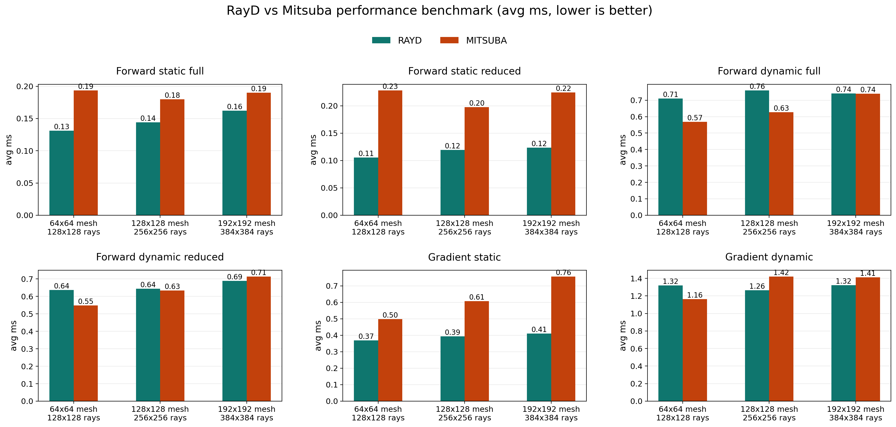
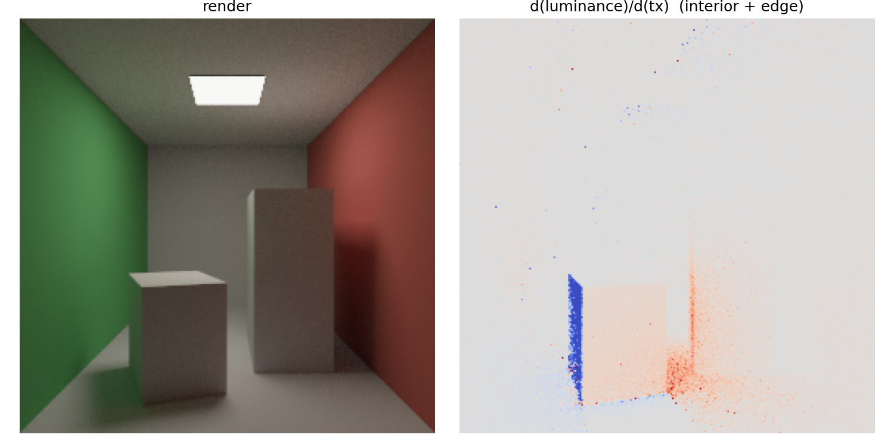
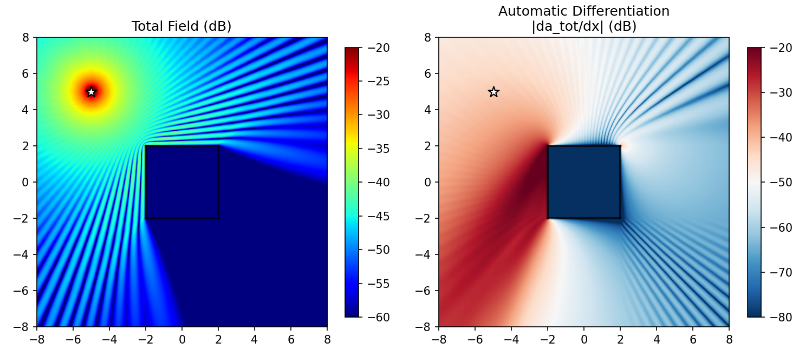

# RayD

[](https://pypi.org/project/rayd/) [](https://pypi.org/project/rayd/)   [](LICENSE)

RayD is a minimalist differentiable ray tracing package wrapping OptiX ray tracing with Dr.Jit autodiff.

```bash
pip install rayd
```

**RayD is not a full renderer.** It is a thin wrapper around Dr.Jit and OptiX for building your own renderers and simulators.

The goal is simple: expose differentiable ray-mesh intersection on the GPU without bringing in a full graphics framework.

RayD provides three frontends:

- **Dr.Jit (Native)** — direct Dr.Jit array API, maximum control
- **PyTorch** — `rayd.torch` module, CUDA `torch.Tensor` in/out, integrates with `torch.autograd`
- **Slang** — C++ POD/handle bridge for Slang `cpp` target interop

## Why RayD?

RayD is for users who want OptiX acceleration and autodiff, but do not want a full renderer.

Why not `Mitsuba`? `Mitsuba` is excellent for graphics rendering, but often too high-level for RF, acoustics, sonar, or custom wave simulation. In those settings, direct access to ray-scene queries and geometry gradients is usually more useful than a full material-light-integrator stack.

RayD keeps only the geometric core:

- differentiable ray-mesh intersection
- scene-level GPU acceleration through OptiX
- edge acceleration structures for nearest-edge queries
- primary-edge sampling support for edge-based gradient terms

For intersection workloads, RayD targets Mitsuba-level performance and matching results with a much smaller API surface.

## What RayD Provides

- `Mesh`: triangle geometry, transforms, UVs, and edge topology
- `Scene`: a container of meshes plus OptiX acceleration
- `scene.intersect(ray)`: differentiable ray-mesh intersection
- `scene.shadow_test(ray)`: occlusion testing
- `scene.nearest_edge(query)`: nearest-edge queries for points and rays, returning `shape_id`, mesh-local `edge_id`, and scene-global `global_edge_id`
- `scene.set_edge_mask(mask)` / `scene.edge_mask()`: scene-global filtering for the secondary-edge BVH used by `nearest_edge(...)`
- edge acceleration data that is useful for edge sampling and edge diffraction methods

## Performance

The chart below was generated on March 25, 2026 on an `NVIDIA GeForce RTX 5080` and `AMD Ryzen 7 9800X3D`, comparing RayD (`0.1.2`) against Mitsuba `3.8.0` with the `cuda_ad_rgb` variant.


Raw benchmark data is stored in [`docs/performance_benchmark.json`](docs/performance_benchmark.json).

- RayD is consistently faster on static forward and static gradient workloads across all three scene sizes.
- Dynamic reduced forward reaches parity or better from the medium scene onward, and dynamic full is effectively tied on the largest case.
- On the largest `192x192` mesh / `384x384` ray benchmark, RayD vs Mitsuba average latency in milliseconds is: static full `0.162 vs 0.190`, static reduced `0.124 vs 0.224`, dynamic full `0.741 vs 0.740`, dynamic reduced `0.689 vs 0.714`, gradient static `0.411 vs 0.757`, gradient dynamic `1.324 vs 1.413`.
- Correctness stayed aligned throughout the sweep: forward mismatch counts remained `0`, and the largest static gradient discrepancy was `9.54e-7`.



## Quick Examples

If you only want to see the package in action, start here:

- [`examples/basics/ray_mesh_intersection.py`](examples/basics/ray_mesh_intersection.py): custom rays against a mesh
- [`examples/basics/nearest_edge_query.py`](examples/basics/nearest_edge_query.py): nearest-edge queries
- [`examples/basics/camera_edge_sampling_gradient.py`](examples/basics/camera_edge_sampling_gradient.py): camera-driven edge-sampling gradients
- [`docs/slang_interop.md`](docs/slang_interop.md): Slang `cpp` target interop for host-side RayD scene queries

### Differentiable Cornell Box with Edge Sampling

GPU path tracing + interior AD + edge sampling [(Li et al.)](https://people.csail.mit.edu/tzumao/diffrt/) in ~180 lines ([`examples/renderer/cornell_box.py`](examples/renderer/cornell_box.py)):




### Differentiable Radio Frequnecy Wave Propagation

([`Mini-Differentiable-RF-Digital-Twin`](https://github.com/Asixa/Mini-Differentiable-RF-Digital-Twin)):




## Minimal Differentiable Ray Tracing Example

The example below traces a single ray against one triangle and backpropagates the hit distance to the vertex positions.

```python
import rayd as rd
import drjit as dr


mesh = rd.Mesh(
    dr.cuda.Array3f([0.0, 1.0, 0.0],
                    [0.0, 0.0, 1.0],
                    [0.0, 0.0, 0.0]),
    dr.cuda.Array3i([0], [1], [2]),
)

verts = dr.cuda.ad.Array3f(
    [0.0, 1.0, 0.0],
    [0.0, 0.0, 1.0],
    [0.0, 0.0, 0.0],
)
dr.enable_grad(verts)

mesh.vertex_positions = verts

scene = rd.Scene()
scene.add_mesh(mesh)
scene.build()

ray = rd.Ray(
    dr.cuda.ad.Array3f([0.25], [0.25], [-1.0]),
    dr.cuda.ad.Array3f([0.0], [0.0], [1.0]),
)

its = scene.intersect(ray)
loss = dr.sum(its.t)
dr.backward(loss)

print("t =", its.t)
print("grad z =", dr.grad(verts)[2])
```

This is the core RayD workflow. Replace the single ray with your own batched rays, RF paths, acoustic paths, or edge-based objectives.

## PyTorch Frontend

`rayd.torch` is an optional Python-level wrapper that mirrors the native API using CUDA `torch.Tensor` inputs and outputs. AD mode is inferred automatically from `requires_grad`.

```python
import rayd.torch as rt

verts = torch.tensor([...], device="cuda", requires_grad=True)
mesh = rt.Mesh(verts, faces)
scene = rt.Scene()
scene.add_mesh(mesh)
scene.build()

its = scene.intersect(rt.Ray(origins, directions))
loss = (its.t - target).pow(2).mean()
loss.backward()  # gradients flow to verts
```

Key conventions:

- vectors use shape `(N, 3)` or `(N, 2)`; `(3,)` and `(2,)` are accepted as batch size `1`
- index tensors use shape `(F, 3)`; images use shape `(H, W)`; transforms use shape `(4, 4)`
- CPU tensors are rejected; `rayd.torch` does not do implicit device transfers

The native Dr.Jit API remains unchanged and does not depend on PyTorch.

### Device Selection

RayD follows Dr.Jit's current-thread CUDA device selection. If you need to
choose a GPU explicitly, do it before constructing any RayD resources:

```python
import rayd as rd

rd.set_device(0)  # also initializes OptiX on that device by default
```

`rd.set_device()` / `rayd.torch.set_device()` are intended for selecting the
device up front. Existing RayD scenes, OptiX pipelines, and BVHs should not be
reused across device switches in the same process.

## Slang Frontend

RayD ships a Slang interop layer for Slang's `cpp` target. Slang code can `import rayd_slang;` and call RayD scene queries directly.

`NearestPointEdge` and `NearestRayEdge` returned through Slang include `global_edge_id` in the same scene-global index space as `scene.edge_info().global_edge_id`.
The Slang bridge also exposes scene edge-mask helpers for host code: `sceneEdgeCount(scene)`, `sceneEdgeMaskValue(scene, index)`, and `sceneSetEdgeMask(scene, maskPtr, count)`.

### Minimal Slang Example

```slang
import rayd_slang;

export float traceRayT(uint64_t sceneHandle,
                       float ox, float oy, float oz,
                       float dx, float dy, float dz)
{
    SceneHandle scene = makeSceneHandle(sceneHandle);
    Ray ray = makeRay(float3(ox, oy, oz), float3(dx, dy, dz));
    Intersection hit = sceneIntersect(scene, ray);
    return itsT(hit);  // use accessor, not hit.t
}
```

Load and call from Python:

```python
import rayd as rd
import rayd.slang as rs

m = rs.load_module("my_shader.slang")  # use rayd.slang.load_module, not slangtorch.loadModule

scene = rd.Scene()
scene.add_mesh(mesh)
scene.build()

t = m.traceRayT(scene.slang_handle, 0.25, 0.25, -1.0, 0.0, 0.0, 1.0)
```

### Differentiable Slang Example

`sceneIntersectAD` returns an `IntersectionAD` with analytic gradients `dt_do` (∂t/∂origin) and `dt_dd` (∂t/∂direction):

```slang
import rayd_slang;

export IntersectionAD traceAD(uint64_t sceneHandle,
                              float ox, float oy, float oz,
                              float dx, float dy, float dz)
{
    SceneHandle scene = makeSceneHandle(sceneHandle);
    Ray ray = makeRay(float3(ox, oy, oz), float3(dx, dy, dz));
    return sceneIntersectAD(scene, ray);
}
```

Use it from Python with `torch.autograd`:

```python
import torch
import rayd as rd
import rayd.slang as rs

m = rs.load_module("my_shader.slang")
scene = rd.Scene()
scene.add_mesh(mesh)
scene.build()

class DiffTrace(torch.autograd.Function):
    @staticmethod
    def forward(ctx, oz):
        ctx.save_for_backward(oz)
        hit = m.traceAD(scene.slang_handle, 0.25, 0.25, oz.item(), 0, 0, 1)
        return torch.tensor(hit.t, device=oz.device)

    @staticmethod
    def backward(ctx, g):
        oz, = ctx.saved_tensors
        hit = m.traceAD(scene.slang_handle, 0.25, 0.25, oz.item(), 0, 0, 1)
        return torch.tensor(hit.dt_do.z * g.item(), device=oz.device)

oz = torch.tensor(-1.0, device="cuda", requires_grad=True)
t = DiffTrace.apply(oz)
t.backward()
print(f"t={t.item()}, dt/doz={oz.grad.item()}")  # t=1.0, dt/doz=-1.0
```

`load_module()` runs `slangc -target cpp`, auto-generates pybind11 bindings, and links against `rayd_core`. See [`docs/slang_interop.md`](docs/slang_interop.md) for the full compilation pipeline, API reference, and known workarounds.

## Edge Acceleration Structure

RayD also provides a scene-level edge acceleration structure.

This is useful for:

- edge sampling
- nearest-edge queries
- visibility-boundary terms
- geometric edge diffraction models

`Scene.set_edge_mask(mask)` filters this secondary-edge BVH in scene-global edge index space. It does not modify `scene.edge_info()`, `scene.edge_topology()`, `scene.mesh_edge_offsets()`, or primary-edge camera sampling.

In other words, RayD is not limited to triangle hits. It also gives you direct access to edge-level geometry queries, which are important in many non-graphics simulators.

## Compiling Locally

RayD is a Python package with a C++/CUDA extension.

You need Python `>=3.10`, CUDA Toolkit `>=11.0`, CMake, a C++17 compiler, `drjit>=1.2.0`, `nanobind==2.9.2`, and `scikit-build-core`.

On Windows, use Visual Studio 2022 with Desktop C++ tools. On Linux, use GCC or Clang with C++17 support.

### Recommended environment

```powershell
conda create -n myenv python=3.10 -y
conda activate myenv
python -m pip install -U pip setuptools wheel
python -m pip install cmake scikit-build-core nanobind==2.9.2
python -m pip install "drjit>=1.2.0"
```

### Install

```powershell
conda activate myenv
python -m pip install .
```

## Dependencies

RayD depends on:

- Python `3.10+`
- Dr.Jit `1.2.0+`
- OptiX `8+`

RayD does not include:

- BSDFs
- emitters
- integrators
- scene loaders
- image I/O
- path tracing infrastructure

That is by design.

## Repository Layout

- [`rayd/`](rayd): Python package (flat layout)
- [`rayd/torch/`](rayd/torch): PyTorch frontend
- [`rayd/slang/`](rayd/slang): Slang / slangtorch interop utilities
- [`include/rayd/`](include/rayd): public C++ headers
- [`src/`](src): C++ and CUDA implementation
- [`src/rayd.cpp`](src/rayd.cpp): Python bindings
- [`include/rayd/slang/interop.h`](include/rayd/slang/interop.h): C++ POD/handle bridge for Slang
- [`include/rayd/slang/rayd.slang`](include/rayd/slang/rayd.slang): Slang declarations for the C++ interop layer
- [`examples/`](examples): basic, renderer, and Slang examples
- [`tests/drjit/`](tests/drjit): Dr.Jit native geometry tests
- [`tests/torch/`](tests/torch): PyTorch frontend tests
- [`tests/slang/`](tests/slang): Slang interop and gradient tests
- [`docs/api_reference.md`](docs/api_reference.md): Python API reference
- [`docs/slang_interop.md`](docs/slang_interop.md): Slang interop notes and examples

## Testing

```powershell
python -m unittest tests.drjit.test_geometry -v
```

Optional PyTorch wrapper tests:

```powershell
python -m unittest tests.torch.test_geometry -v
```

Optional Slang interop and gradient tests (requires `slangtorch`):

```powershell
python -m unittest tests.slang.test_slang -v
```

## Credits

RayD is developed with reference to:

- [psdr-jit](https://github.com/andyyankai/psdr-jit)
- [redner](https://github.com/BachiLi/redner)
- [mitsuba3](https://github.com/mitsuba-renderer/mitsuba3)

## Citation

```bibtex
@inproceedings{chen2026rfdt,
  title     = {Physically Accurate Differentiable Inverse Rendering
               for Radio Frequency Digital Twin},
  author    = {Chen, Xingyu and Zhang, Xinyu and Zheng, Kai and
               Fang, Xinmin and Li, Tzu-Mao and Lu, Chris Xiaoxuan
               and Li, Zhengxiong},
  booktitle = {Proceedings of the 32nd Annual International Conference
               on Mobile Computing and Networking (MobiCom)},
  year      = {2026},
  doi       = {10.1145/3795866.3796686},
  publisher = {ACM},
  address   = {Austin, TX, USA},
}
```

## License

BSD 3-Clause. See [LICENSE](LICENSE).
