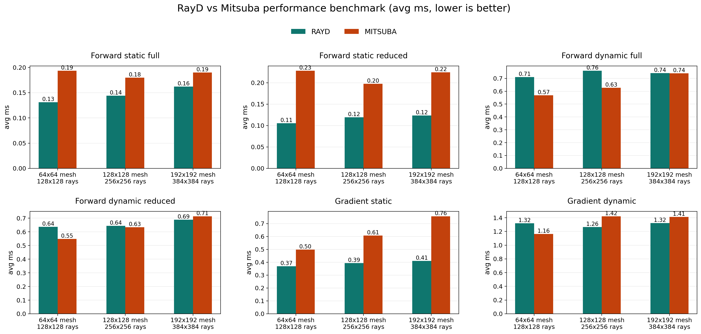

# RayD

[](https://pypi.org/project/rayd/) [](https://pypi.org/project/rayd/)   [](LICENSE)

RayD is a Dr.Jit-native GPU library for differentiable ray geometry and multipath simulation primitives built on OptiX.

```bash
pip install rayd
```

RayD is not a full renderer. It exposes low-level scene, ray, edge, visibility, and reflection-path queries for building custom renderers, RF simulators, acoustic tools, and inverse-design systems without adopting a material-light-integrator framework.

## Release compatibility

Release wheels cover Linux x86-64 and Windows x86-64 on CPython 3.10-3.14. They are built with CUDA 12.8 and contain native code for `sm_70`, `sm_75`, `sm_80`, `sm_86`, `sm_89`, `sm_90`, `sm_100`, `sm_101`, and `sm_120`, plus `compute_120` PTX for forward compatibility. This spans RTX 2080-class Turing GPUs through current data-center and GeForce/RTX PRO Blackwell families.

RayD is Dr.Jit-native and does not depend on PyTorch. Because its nanobind extension uses the CPython ABI, CI builds one wheel per Python version rather than one Python-independent wheel. The complete build matrix and release configuration are documented in [`CI_BUILD_MATRIX.md`](CI_BUILD_MATRIX.md).

## Scope

RayD focuses on geometry and wave-propagation primitives:

- differentiable ray-mesh intersection
- scene-level GPU acceleration through OptiX
- nearest-edge queries through a scene-global edge BVH
- primary-edge sampling support for edge-based gradient terms
- segment visibility and multipath reflection primitives
- Dr.Jit arrays and Dr.Jit autodiff as the public Python API

RayD intentionally does not provide:

- a material or BSDF system
- emitters
- integrators
- scene loading
- image I/O
- a complete path-tracing runtime
- alternate Python frontend wrappers

## Why RayD?

RayD is for users who need fast differentiable geometry queries, but do not want a full rendering framework.

Mitsuba is excellent for physically based rendering, but it can be too high-level when the main workload is RF propagation, acoustics, sonar, visibility analysis, or custom wave simulation. In those settings, direct control over ray-scene queries, edge queries, reflection paths, and geometry gradients is often more useful than a complete renderer.

RayD keeps the API surface small: meshes, scenes, rays, intersections, edges, and multipath query results.

## Core API

- `Mesh`: triangle geometry, transforms, UVs, and edge topology
- `Scene`: a container of meshes plus OptiX acceleration structures
- `scene.intersect(ray)`: differentiable ray-mesh intersection
- `scene.shadow_test(ray)`: occlusion testing
- `scene.nearest_edge(query)`: nearest-edge queries for points and rays
- `scene.set_edge_mask(mask)` / `scene.edge_mask()`: scene-global filtering for secondary-edge queries
- `scene.trace_reflections(...)`: specular reflection-path tracing
- `scene.visible(...)`: batched segment visibility queries
- `scene.trace_refl_epc(...)`: equivalent-path correction primitives for reflection paths
- `scene.accum_dfr_direct(...)` / `scene.accum_dfr(...)`: native diffraction grid accumulation
- `scene.trace_dfr_paths(...)`: compact native first-order diffraction path export

## Feature Overview

Each core query, what it computes, its input/output, and how it behaves under Dr.Jit autodiff (AD):

| API | What it computes | Input -> Output | AD |
| --- | --- | --- | --- |
| `scene.intersect(ray)` | Closest-hit ray-mesh intersection | rays -> `Intersection` (t, point, normal, uv, ids) | **AD** |
| `scene.shadow_test(ray)` | Any-hit occlusion test | rays -> boolean mask | **Boolean** |
| `scene.nearest_edge(point)` | Nearest scene edge to each point | points -> `NearestPointEdge` (distance, points, edge id) | **AD** |
| `scene.nearest_edge(ray)` | Nearest scene edge to each ray (segment on `[0, tmax]` when `tmax` is finite) | rays -> `NearestRayEdge` | **AD** |
| `scene.nearest_edges(point, k)` | k nearest scene edges per point (k <= 16) | points -> `NearestEdgesTopK` | **AD** |
| `scene.visible(start, end)` | Mutual visibility between two segment endpoints | endpoints -> `SegmentVisibility` | **Boolean** |
| `scene.visible_pair / visible_chain / visible_edge` | Shared-origin pair, polyline-chain, and edge-sample visibility | segments -> segment/chain/edge visibility | **Boolean** |
| `scene.trace_reflections(ray, max_bounces)` | Specular reflection paths with image sources | rays -> `ReflectionChain` (hit points, normals, image sources, ids) | **AD** |
| `scene.trace_refl_epc(ray, receiver, ...)` | Equivalent-path-correction reflection toward a receiver | rays + receiver -> `ReflEpc` | **Detached** |
| `scene.trace_refl_epc_field(tx, receiver, ...)` | EPC trace returning the complex reflected field | tx position + receiver + `ReflEpcFieldOptions(AD)` -> `ReflEpcField` (complex E-field) | **Native AD** |
| `scene.accumulate_reflections(...)` | Accumulate reflected field/power onto a grid | rays + grid + material -> `AccumResult` | **Native AD** |
| `scene.accum_dfr_direct(...)` | Native direct/Keller/suffix diffraction accumulation onto a grid | `DfrStates` + `DfrGrid` + `DfrMaterial` -> `DfrAccum` | **Native AD** for direct, Keller, and suffix-reflection order-1, including suffix reflector mesh-vertex gradients; detached for unsupported AD strategies |
| `scene.accum_dfr(...)` | Native order-2/3 diffraction-chain accumulation onto a grid | initial/recursive `DfrStates` + grid + material -> `DfrAccum` | **Native AD** for direct, Keller, and suffix-reflection order-2/3 chains, including suffix reflector mesh-vertex gradients |
| `scene.trace_dfr_paths(...)` | Compact first-order diffraction path export | tx/rx + `DfrStates` + `DfrMaterial` -> `DfrPaths` | **AD** |

AD legend:

- **AD** - differentiable geometry: geometric outputs carry Dr.Jit gradients with respect to mesh vertices and transforms; the discrete hit/edge/path selection runs detached.
- **Native AD** - the native RayD multipath implementation preserves Dr.Jit gradients for continuous inputs passed as AD arrays and supplies RayD-side derivative code. Diffraction grid accumulation uses CUDA custom-op JVP/VJP over a fixed OptiX forward tape for direct, Keller, and suffix-reflection order-1 and order-2/3 chain accumulation. Discrete visibility/path-selection decisions remain detached.
- **Boolean** - returns occlusion/visibility booleans and is not differentiable.
- **Detached** - native fast path: runs detached only and rejects AD inputs.

Trace vs. accum:

- `trace_*` APIs enumerate geometric or field paths and return per-ray/per-path records. They do not reduce contributions into receiver grids.
- `accum_*` APIs launch native accumulation kernels that reduce contributions into aggregate outputs, usually grid cells, with atomic or tiled writes. They are the high-throughput path for radiomap-style workloads when individual path records are not needed.

## Minimal Example

The example below traces one ray against one triangle and backpropagates the hit distance to the vertex positions.

```python
import drjit as dr
import rayd as rd


mesh = rd.Mesh(
    dr.cuda.Array3f([0.0, 1.0, 0.0],
                    [0.0, 0.0, 1.0],
                    [0.0, 0.0, 0.0]),
    dr.cuda.Array3i([0], [1], [2]),
)

verts = dr.cuda.ad.Array3f(
    [0.0, 1.0, 0.0],
    [0.0, 0.0, 1.0],
    [0.0, 0.0, 0.0],
)
dr.enable_grad(verts)
mesh.vertex_positions = verts

scene = rd.Scene()
scene.add_mesh(mesh)
scene.build()

ray = rd.RayAD(
    dr.cuda.ad.Array3f([0.25], [0.25], [-1.0]),
    dr.cuda.ad.Array3f([0.0], [0.0], [1.0]),
)

its = scene.intersect(ray)
loss = dr.sum(its.t)
dr.backward(loss)

print("t =", its.t)
print("grad z =", dr.grad(verts)[2])
```

## Edge Queries

RayD provides a scene-level edge acceleration structure for nearest-edge and edge-sampling workloads.

This is useful for:

- edge sampling
- nearest-edge queries
- visibility-boundary terms
- geometric diffraction models

`Scene.set_edge_mask(mask)` filters the secondary-edge BVH in scene-global edge index space. It does not modify `scene.edge_info()`, `scene.edge_topology()`, or `scene.mesh_edge_offsets()`.

## Multipath Queries

RayD includes low-level reflection and visibility primitives for custom wave simulators:

- `trace_reflections(...)` for specular reflection chains
- `visible(...)`, `visible_pair(...)`, `visible_chain(...)`, and `visible_edge(...)` for segment and polyline-chain visibility
- `trace_refl_epc(...)` and `trace_refl_epc_field(...)` for equivalent-path correction workflows
- `accumulate_reflections(...)` for reflection grid accumulation workloads
- `accum_dfr_direct(...)`, `accum_dfr(...)`, `trace_dfr_paths(...)` for native diffraction kernels

These APIs expose primitives, not a complete propagation simulator. Callers own the source model, receiver model, material policy, objective, and optimization loop.

Naming rule: use `Dfr` for diffraction (`DfrStates`, `DfrAccum`, `accum_dfr_direct`), `Refl` for reflection-specific short names, keep `Epc` in equivalent-path-correction APIs, and reserve `AD` for automatic differentiation. See [`API_NAMING_STANDARD.md`](API_NAMING_STANDARD.md).

## Examples

- [`examples/basics/ray_mesh_intersection.py`](examples/basics/ray_mesh_intersection.py): custom rays against a mesh
- [`examples/basics/nearest_edge_query.py`](examples/basics/nearest_edge_query.py): nearest-edge queries
- [`examples/renderer/cornell_box.py`](examples/renderer/cornell_box.py): a compact renderer built on RayD primitives

## Performance

The chart below was generated on March 25, 2026 on an `NVIDIA GeForce RTX 5080` and `AMD Ryzen 7 9800X3D`, comparing RayD (`0.1.2`) against Mitsuba `3.8.0` with the `cuda_ad_rgb` variant.

Raw benchmark data is stored in [`docs/performance_benchmark.json`](docs/performance_benchmark.json).

- RayD is consistently faster on static forward and static gradient workloads across all three scene sizes.
- Dynamic reduced forward reaches parity or better from the medium scene onward, and dynamic full is effectively tied on the largest case.
- On the largest `192x192` mesh / `384x384` ray benchmark, RayD vs Mitsuba average latency in milliseconds is: static full `0.162 vs 0.190`, static reduced `0.124 vs 0.224`, dynamic full `0.741 vs 0.740`, dynamic reduced `0.689 vs 0.714`, gradient static `0.411 vs 0.757`, gradient dynamic `1.324 vs 1.413`.
- Correctness stayed aligned throughout the sweep: forward mismatch counts remained `0`, and the largest static gradient discrepancy was `9.54e-7`.



## Device Selection

RayD follows Dr.Jit's current-thread CUDA device selection. Choose a GPU before constructing RayD resources:

```python
import rayd as rd

rd.set_device(0)
```

Existing RayD scenes, OptiX pipelines, and BVHs should not be reused across device switches in the same process.

## Building Locally

RayD is a Python package with a C++/CUDA extension.

You need Python `>=3.10`, CUDA Toolkit `>=11.0`, CMake, a C++17 compiler, `drjit==1.3.1`, `nanobind==2.9.2`, and `scikit-build-core`.

On Windows, use Visual Studio 2022 with Desktop C++ tools. On Linux, use GCC or Clang with C++17 support.

Recommended environment:

```powershell
conda create -n myenv python=3.10 -y
conda activate myenv
python -m pip install -U pip setuptools wheel
python -m pip install cmake scikit-build-core nanobind==2.9.2
python -m pip install drjit==1.3.1
```

Install from the repository root:

```powershell
python -m pip install .
```

For editable development builds:

```powershell
python -m pip install --no-build-isolation -ve .
```

## Repository Layout

- [`rayd/`](rayd): Python package and native extension loader
- [`include/rayd/`](include/rayd): public C++ headers
- [`include/rayd/edge/`](include/rayd/edge): edge-query data structures
- [`include/rayd/multipath/`](include/rayd/multipath): multipath query result and option types
- [`src/`](src): C++ and CUDA implementation
- [`src/edge/`](src/edge): edge BVH and edge-query implementation
- [`src/multipath/`](src/multipath): reflection, visibility, EPC, and accumulation kernels
- [`src/rayd.cpp`](src/rayd.cpp): Python bindings
- [`examples/`](examples): small usage examples
- [`tests/drjit/`](tests/drjit): Dr.Jit-native geometry, edge, visibility, and multipath tests
- [`tests/test_project_metadata.py`](tests/test_project_metadata.py): packaging and repository-boundary checks

## Testing

```powershell
python -m unittest tests.drjit.test_geometry -v
python -m unittest tests.drjit.test_visibility_topk -v
python -m unittest tests.drjit.test_reflection_epc -v
python -m unittest tests.drjit.test_reflection_accumulation -v
python -m unittest tests.test_project_metadata -v
```

The default development environment used by this repository is:

```powershell
conda activate witwin3
```

## Credits

RayD is developed with reference to:

- [psdr-jit](https://github.com/andyyankai/psdr-jit)
- [redner](https://github.com/BachiLi/redner)
- [mitsuba3](https://github.com/mitsuba-renderer/mitsuba3)

## Citation

```bibtex
@inproceedings{chen2026rfdt,
  title     = {Physically Accurate Differentiable Inverse Rendering
               for Radio Frequency Digital Twin},
  author    = {Chen, Xingyu and Zhang, Xinyu and Zheng, Kai and
               Fang, Xinmin and Li, Tzu-Mao and Lu, Chris Xiaoxuan
               and Li, Zhengxiong},
  booktitle = {Proceedings of the 32nd Annual International Conference
               on Mobile Computing and Networking (MobiCom)},
  year      = {2026},
  doi       = {10.1145/3795866.3796686},
  publisher = {ACM},
  address   = {Austin, TX, USA},
}
```

## License

BSD 3-Clause. See [LICENSE](LICENSE).
